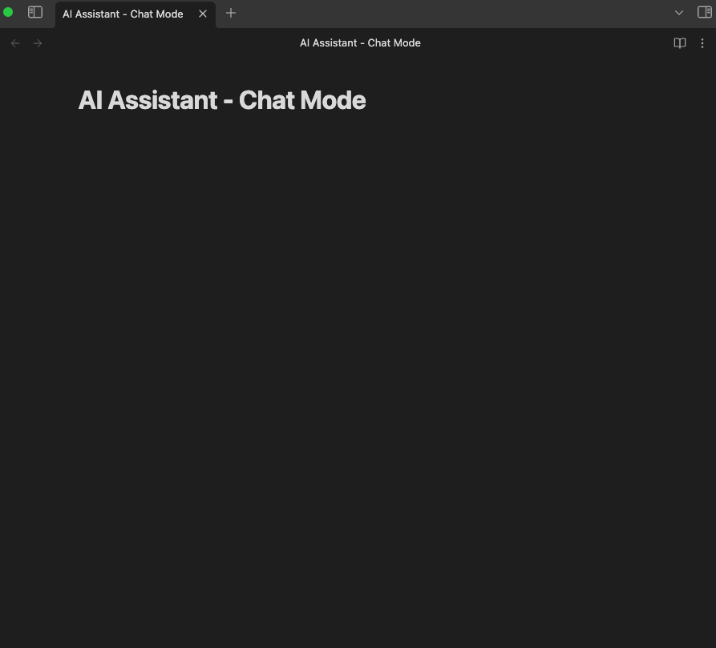

# Obsidian AI Assistant

Simple plugin to enable interactions with AI models such as [OpenAI ChatGPT](https://openai.com/blog/chatgpt) 
directly from your [Obsidian](https://obsidian.md/) notes.

## How to use
Currently, you have two different approaches to interact with the assistant:
1. Chat mode,
2. Prompt mode.

|        Chat Mode         |       Prompt Mode         | 
|:------------------------:|:-------------------------:|
|   |  |

### Chat mode
You can chat with an AI assistant from your Vault to generate content for your notes.
From the chat, you can clic on any interaction to copy it directly to your clipboard.
You can also copy the whole conversation.

### Prompt mode
Prompt mode allows you to select text from your existing note as input for the assistant.
From here you can ask the assistant to translate, summarize, generate code ect.

## Settings
- Model choice: choice of model. Currently `gpt-3.5-turbo` and `gpt-4` are supported.
- Temperature and max token
- Replace or Add below: In prompt mode, after having selected text from your note and enter your prompt, 
you can decide to replace your text by the assistant answer or to paste it bellow.

## How to install

1. `cd path/to/vault/.obsidian/plugins`
2. `git clone https://github.com/qgrail/obsidian-ai-assistant.git && cd obsidian-ai-assistant`
3. `npm install && npm run build`
4. Open **Obsidian Preferences** -> **Community plugins**
5. Refresh Installed plugins and activate AI Assistant.

## Requirement

To use this plugin, you need an official API key from [OpenAI](https://platform.openai.com/account/api-keys).

